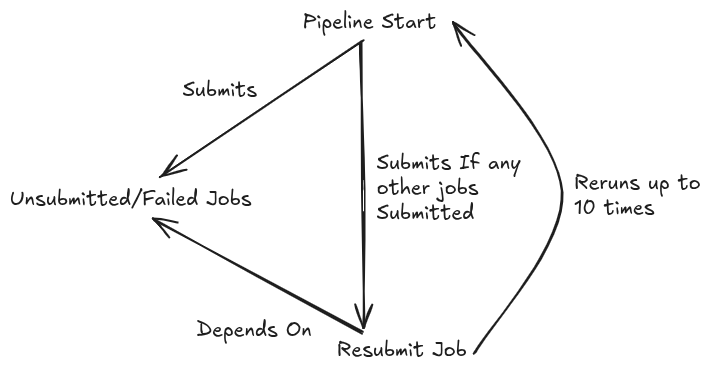

# Pipeline Mini

This is intended as a miniature mock-up of the ASKAP pipeline. It mechanical workings are quite different, but its interation with the job queue and general workflow is the same. 
If the queue is empty, it should only take a couple of minutes or so to complete.

## Wokrflow


## Usage

Once deployed, it can be loaded 
```bash
module use [Module Deploy Location]
module load pipeline-mini/[Optional Version]
```
And then run with
```bash
pipeline-mini --account [MY ACCOUNT] --partition [MY PARTITION]
```

Which will submit 3 jobs. One of them will fail, and then the final job will resubmit itself. 
On resubmission, the pipeline will resubmit itself along with a new batch job of the failed job. This time, that job will pass.
When the pipeline runs again (having resubmit itself), it will see that all jobs have passed, and it will end.
